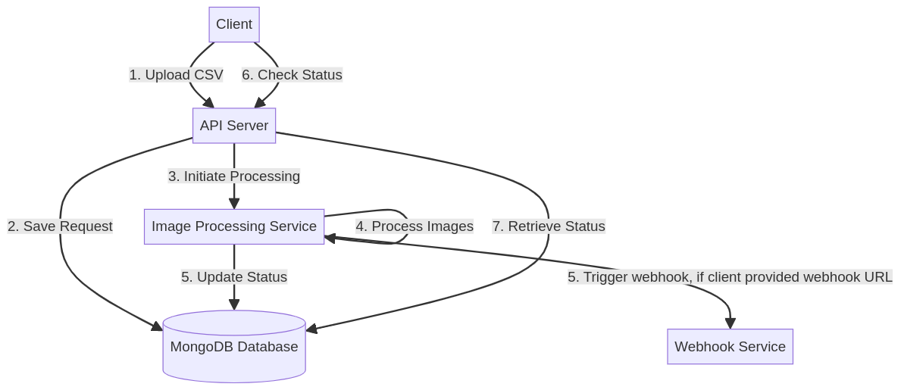
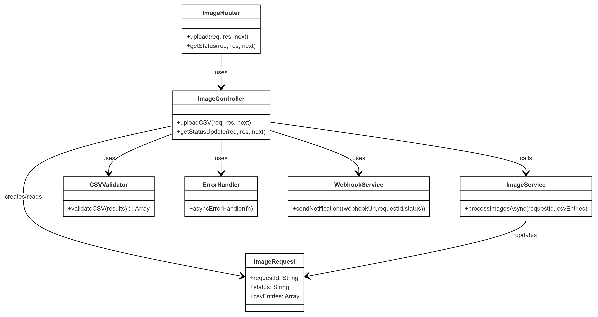
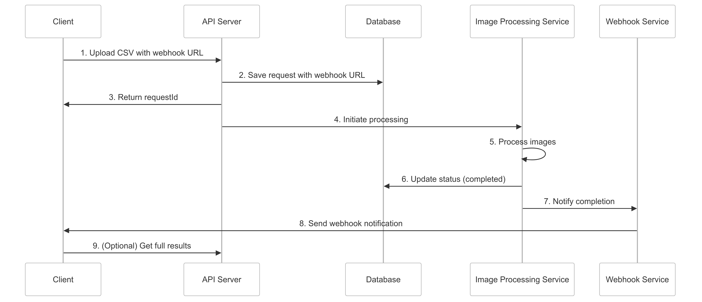
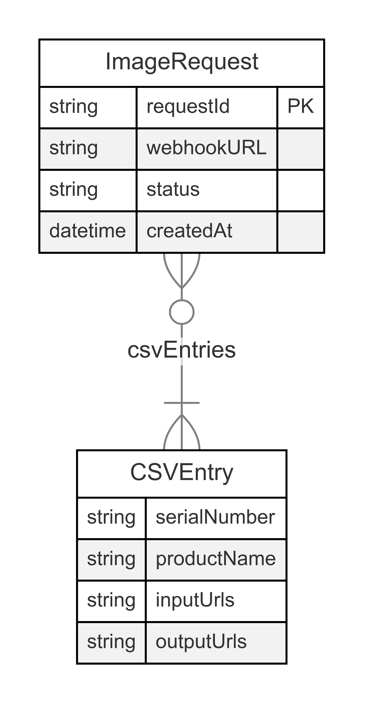

# Image Processing System - Technical Design Document

## 1. System Overview

The Image Processing System is designed to handle bulk image processing requests submitted via CSV files. It provides an API for uploading CSV files containing image URLs and retrieving the status of processing requests.

## 2. System Architecture

### 2.1 High-Level Architecture Diagram

.

### 2.2 Component Descriptions

1. **Client**: The end-user or system interacting with our API.
2. **API Server**: Handles incoming requests, file uploads, and status checks.
3. **Database**: Stores request information and processing status.
4. **Image Processing Service**: Processes the images asynchronously.
5. **Webhook Service**: Send completion notification to the client.

## 3. Detailed Component Descriptions

### 3.1 API Server

#### 3.1.1 Routes (imageRoutes.js)

- **Role**: Defines the API endpoints and routes requests to appropriate controllers.
- **Functions**:
  - Configures the `/upload` POST route for CSV uploads.
  - Configures the `/status/:requestId` GET route for status checks.
- **Dependencies**:
  - Express.js for routing
  - Multer for handling file uploads

#### 3.1.2 Controllers (imageController.js)

- **Role**: Implements the business logic for handling requests.
- **Functions**:
  - `uploadCSV`: Handles CSV file upload, validation, and initiates processing.
  - `getStatusUpdate`: Retrieves the status of a processing request.
- **Dependencies**:
  - csv-parser for parsing CSV files
  - UUID for generating unique request IDs

#### 3.1.3 Utilities (csvValidator.js)

- **Role**: Validates the structure and content of uploaded CSV files.
- **Functions**:
  - `validateCSV`: Ensures the CSV contains required columns and valid data.

#### 3.1.4 Error Handler (errorHandler.js)

- **Role**: Provides centralized error handling for asynchronous operations.
- **Functions**:
  - `asyncErrorHandler`: Wraps async functions to catch and forward errors to Express error middleware.

### 3.2 Database

#### 3.2.1 Models (imageRequest.js)

- **Role**: Defines the schema for storing image processing requests.
- **Structure**:
  - `requestId`: Unique identifier for the request
  - `status`: Current status of the processing request
  - `webhookURL`: Optional webhook URL provided by the user
  - `csvEntries`: Array of objects containing:
    - `serialNumber`: Identifier for each row in the CSV
    - `productName`: Name of the product associated with the images
    - `inputUrls`: Array of image URLs to be processed

### 3.3 Image Processing Service (imageService.js)

- **Role**: Handles the asynchronous processing of csv.
- **Functions**:
  - `processImagesAsync`: Processes images urls for a given request ID.

#### 3.3.1 Worker Task (workerTask.cjs)

- **Role**: Handles the chunk of csv rows.
- **Functions**:
    - `processImagesWorker`: Processes a given chunk of a data with the following steps for each row:- 
      - fetches images for every imageURLs.
      - compresses the image by 50%.
      - uploads to storage(simulated storage with fixed sleep time).
## 4. Request Flow

1. **CSV Upload**:
   - Client uploads a CSV file to the `/upload` endpoint.
   - The file is temporarily stored using Multer.
   - The CSV is parsed and validated.
   - A new request entry is created in the database with a "pending" status.
   - The request ID is returned to the client.
   - Asynchronous image processing is initiated.

2. **Image Processing**:
   - The Image Processing Service processes each image URL from the CSV.
   - The database is updated with the current status and results.

3. **Status Check**:
   - Client queries the `/status/:requestId` endpoint with their request ID.
   - The current status and processing results are retrieved from the database and returned.

## 5. Error Handling

- CSV validation errors are returned immediately during the upload process.
- Asynchronous errors during image processing are logged and reflected in the request status.
- The `asyncErrorHandler` wrapper ensures that asynchronous errors in route handlers are properly caught and passed to Express error middleware.

## 6. Scalability Considerations

- The asynchronous nature of image processing allows for horizontal scaling of the Image Processing Service.
- Consider implementing a job queue (e.g., Redis, RabbitMQ) for better management of processing tasks in a distributed environment.
- Implement caching (e.g., Redis) for frequent status checks to reduce database load.

## 7. Security Considerations

- Implement rate limiting on API endpoints to prevent abuse.
- Validate and sanitize all input, especially the content of uploaded CSV files.
- Use secure protocols (HTTPS) for all API communications.
- Implement authentication and authorization for API access.

## 8. Future Enhancements

- Add support for different image processing operations.
- Create a user interface for CSV upload and status checking.
- Add support for other input formats besides CSV.
